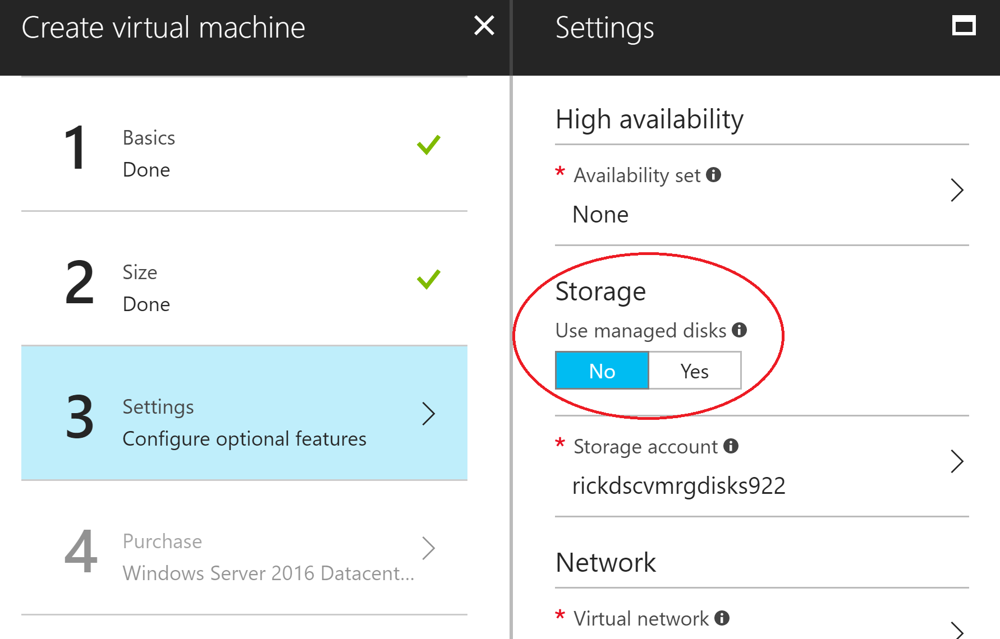

# Create A Linux Custom Image Managed Disk

Important: This shows you how to create a VM with an **unmanaged** disk. Please note that using a **manged** disk has benefits and is the recommended approach.

Steps:

1. Create the Linux VM using the [portal] you can follow this [tutorial](https://docs.microsoft.com/azure/virtual-machines/windows/quick-create-portal) but in step 3 (Settings) choose **not** to use **Use managed disks** on the "Storage" section.



2. [Connect](https://docs.microsoft.com/azure/virtual-machines/linux/tutorial-manage-vm#connect-to-vm) to the machine via SSH and install the software that you want available on your image.

3. You need to remove personal account information which makes it safer to deploy multiple times. Use the waagent command with the -deprovision+user parameter on your source Linux VM, that will delete machine specific files and data. See [Deprovision the VM](https://docs.microsoft.com/azure/virtual-machines/linux/capture-image#step-1-deprovision-the-vm)

    Note: be sure to install the desired software on your VM prior to this step. Once you deprovision you won't be able to login with admin rights to the VM anymore.

4. Create VMs using template building blocks version 2
    - Create a *VirtualMachine* parameters file setting all the necessary values. Check the wiki on how to [Create a Template Building Blocks Parameter File](https://github.com/mspnp/template-building-blocks/wiki/create-a-template-building-blocks-parameter-file) and the [Virtual Machines](https://github.com/mspnp/template-building-blocks/wiki/Virtual-Machines) reference.
    - In *storageAccounts* set "managed" to false and in the "accounts" array specify the storage account name where the OS disk is located.
    - In *osDisk* set "createOption" to "fromImage" and specify the full *VHD URI* to the VM OS disk on the "images" array. This URI can be copied from the portal, entering the *disks* tab of your VM and then clicking on the OS disk.
    
    This sample creates 2 VMs from a VHD:

```JSON
{
    "$schema": "https://raw.githubusercontent.com/mspnp/template-building-blocks/master/schemas/buildingBlocks.json",
    "contentVersion": "1.0.0.0",
    "parameters": {
        "buildingBlocks": {
            "value": [
                {
                    "type": "VirtualMachine",
                    "settings": {
                        "vmCount": 2,
                        "namePrefix": "vm-prefix",
                        "size": "Standard_DS1_v2",
                        "adminUsername": "testadminuser",
                        "adminPassword": "test$!Passw0rd111",
                        "virtualNetwork": {
                            "name": "vnet-name"
                        },
                        "nics": [
                            {
                                "isPublic": false,
                                "privateIPAllocationMethod": "Static",
                                "startingIPAddress": "10.1.1.84",
                                "subnetName": "subnet-name"
                            }
                        ],
                        "storageAccounts": {
                            "managed": false,
                            "accounts": [
                                "storage-account-name"
                            ]
                        },                        
                        "osType": "linux",
                        "osDisk": {
                            "createOption": "fromImage",
                            "images": [
                                "https://storage-account-name.blob.core.windows.net/vhds/vhd-name.vhd"
                            ]
                        }
                    }
                }
            ]
        }
    }
}
```

## More Info
- [Install Azure Building Blocks](https://github.com/mspnp/template-building-blocks/wiki/Install-Azure-Building-Blocks)
- [Create a Template Building Blocks Parameter File](https://github.com/mspnp/template-building-blocks/wiki/create-a-template-building-blocks-parameter-file)
- [Virtual Machines](https://github.com/mspnp/template-building-blocks/wiki/Virtual-Machines) reference
- [Command Line Reference](https://github.com/mspnp/template-building-blocks/wiki/command-line-reference)