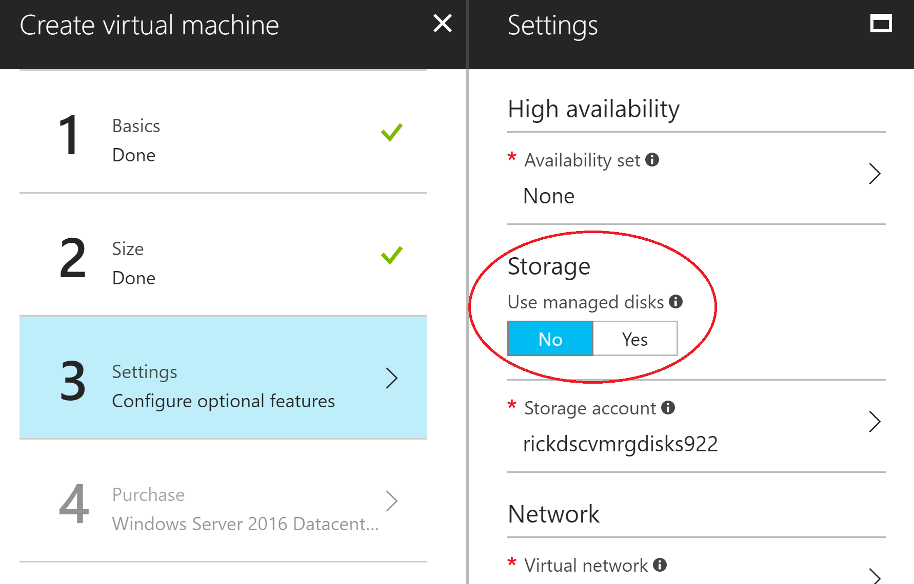

# Create An Unmanaged Windows Custom Image

Important: This shows you how to create a VM with an **unmanaged** disk. Please note that using a **manged** disk has benefits and is the recommended approach.

Steps:

1. Create the Windows VM using the Azure Portal, you can follow this [tutorial](https://docs.microsoft.com/azure/virtual-machines/windows/quick-create-portal) but in step 3 (Settings) choose **not** to use **Use managed disks** on the "Storage" section.



Or you can use the following sample script as a base to create your VM using PowerShell:

```powershell
# Create an inbound network security group rule for port 3389
$nsgRuleRDP = New-AzureRmNetworkSecurityRuleConfig -Name myNetworkSecurityGroupRuleRDP  -Protocol Tcp `
    -Direction Inbound -Priority 1000 -SourceAddressPrefix * -SourcePortRange * -DestinationAddressPrefix * `
    -DestinationPortRange 3389 -Access Allow

# Create an inbound network security group rule for port 80
$nsgRuleWeb = New-AzureRmNetworkSecurityRuleConfig -Name myNetworkSecurityGroupRuleWWW  -Protocol Tcp `
    -Direction Inbound -Priority 1001 -SourceAddressPrefix * -SourcePortRange * -DestinationAddressPrefix * `
    -DestinationPortRange 80 -Access Allow

# Create a network security group
$nsg = New-AzureRmNetworkSecurityGroup -ResourceGroupName myResourceGroup -Location $location `
    -Name myNetworkSecurityGroup -SecurityRules $nsgRuleRDP,$nsgRuleWeb

# Create a virtual network card and associate with public IP address and NSG
$nic = New-AzureRmNetworkInterface -Name myNic -ResourceGroupName myResourceGroup -Location $location `
    -SubnetId $vnet.Subnets[0].Id -PublicIpAddressId $pip.Id -NetworkSecurityGroupId $nsg.Id

# Define a credential object
$cred = Get-Credential

#VM config
$vmsize = "Standard_DS2"
$vmName="myVM" 
$vm = New-AzureRmVMConfig -VMName $vmName -VMSize $vmSize
$pubName = ”MicrosoftWindowsServer”
$offerName = ”WindowsServer”
$skuName = ”2016-Datacenter”
$vm = Set-AzureRmVMOperatingSystem -VM $vm -Windows -ComputerName $vmName -Credential $cred
$vm = Set-AzureRmVMSourceImage -VM $vm -PublisherName $pubName -Offer $offerName -Skus $skuName -Version "latest" 
$vm = Add-AzureRmVMNetworkInterface -VM $vm -Id $NIC.Id 

# Create a new storage account
New-AzureRmStorageAccount -ResourceGroupName "MyResourceGroup" -AccountName "MyStorageAccount" -Location $location -SkuName "Standard_LRS"

# Disk setup
$diskName = ”jason-disk”
$storageaccount = "contoso321"
$STA = Get-AzureRmStorageAccount -ResourceGroupName $rgName -Name $storageAccount
$OSDiskUri = $STA.PrimaryEndpoints.Blob.ToString() + "vhds/" + $diskName? + ".vhd"
$vm = Set-AzureRmVMOSDisk -VM $vm -Name $diskName -VhdUri $OSDiskUri -CreateOption fromImage 

# Create the virtual machine
New-AzureRmVM -ResourceGroupName myResourceGroup -Location $location -VM $vm
```


2. [Connect](https://docs.microsoft.com/azure/virtual-machines/windows/quick-create-portal#connect-to-virtual-machine) to the VM using RDP and install the software that you want available on your image.

3. [Generalize the VM](https://docs.microsoft.com/azure/virtual-machines/windows/sa-copy-generalized?toc=%2Fazure%2Fvirtual-machines%2Fwindows%2Ftoc.json#deallocate-the-vm-and-set-the-state-to-generalized) using sysprep. That will remove all your personal account information, among other things, and prepare the machine to be used as an image.

    Note: be sure to install the desired software on your VM prior to this step. Once you generalize the VM you won't be able to login with admin rights to the VM anymore.

4. Create VMs using template building blocks version 2
    - Create a *VirtualMachine* parameters file setting all the necessary values. Check the wiki on how to [Create a Template Building Blocks Parameter File](https://github.com/mspnp/template-building-blocks/wiki/create-a-template-building-blocks-parameter-file) and the [Virtual Machines](https://github.com/mspnp/template-building-blocks/wiki/Virtual-Machines) reference.
    - In *storageAccounts* set "managed" to false and in the "accounts" array specify the storage account name where the OS disk is located.
    - In *osDisk* set "createOption" to "fromImage" and specify the full *VHD URI* to the VM OS disk on the "images" array. This URI can be copied from the portal, entering the *disks* tab of your VM and then clicking on the OS disk.
    
    This sample creates 2 VMs from a VHD:

```JSON
{
    "$schema": "https://raw.githubusercontent.com/mspnp/template-building-blocks/master/schemas/buildingBlocks.json",
    "contentVersion": "1.0.0.0",
    "parameters": {
        "buildingBlocks": {
            "value": [
                {
                    "type": "VirtualMachine",
                    "settings": {
                        "vmCount": 2,
                        "namePrefix": "vm-prefix",
                        "size": "Standard_DS1_v2",
                        "adminUsername": "testadminuser",
                        "adminPassword": "test$!Passw0rd111",
                        "virtualNetwork": {
                            "name": "vnet-name"
                        },
                        "nics": [
                            {
                                "isPublic": false,
                                "privateIPAllocationMethod": "Static",
                                "startingIPAddress": "10.1.1.84",
                                "subnetName": "subnet-name"
                            }
                        ],
                        "storageAccounts": {
                            "managed": false,
                            "accounts": [
                                "storage-account-name"
                            ]
                        },                        
                        "osType": "windows",
                        "osDisk": {
                            "createOption": "fromImage",
                            "images": [
                                "https://storage-account-name.blob.core.windows.net/vhds/vhd-name.vhd"
                            ]
                        }
                    }
                }
            ]
        }
    }
}
```

## More Info
- [Install Azure Building Blocks](https://github.com/mspnp/template-building-blocks/wiki/Install-Azure-Building-Blocks)
- [Create a Template Building Blocks Parameter File](https://github.com/mspnp/template-building-blocks/wiki/create-a-template-building-blocks-parameter-file)
- [Virtual Machines](https://github.com/mspnp/template-building-blocks/wiki/Virtual-Machines) reference
- [Command Line Reference](https://github.com/mspnp/template-building-blocks/wiki/command-line-reference)