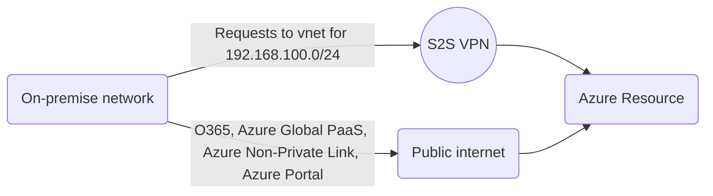
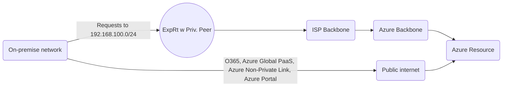
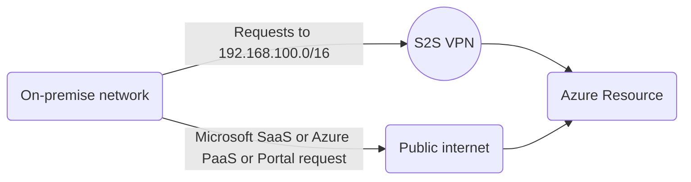
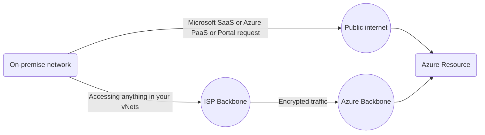
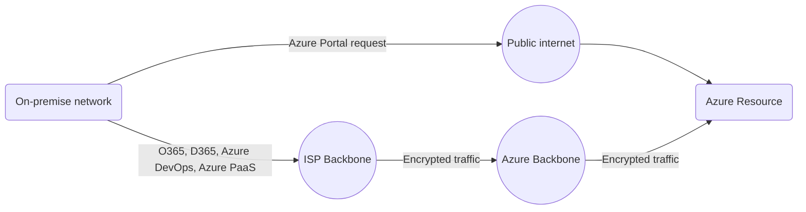
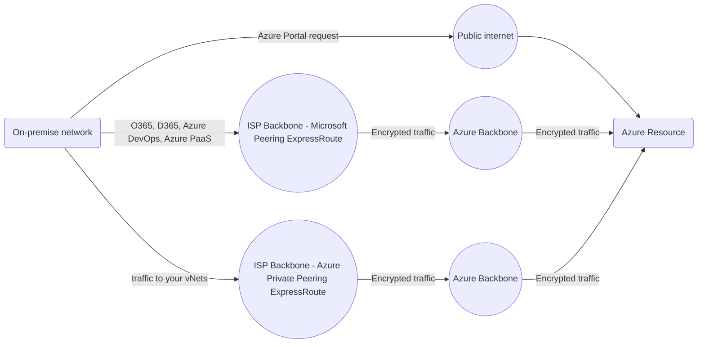

# FAB 
- Private connection between your on-premise data center and Microsoft Azure backbone
- Faster speed
- Least latency
- Better reliability
- More secure (end to end security via both encryption and private link to Azure)
- Can add high availability easily

[FAQ](https://docs.microsoft.com/en-us/azure/expressroute/expressroute-faqs)

# Requirements
**ExpressRoute Partner** - You first need to subscribe to an Azure ExpressRoute Partner (i.e.
AT&T NetBond, Comcast, Equinix, Etc.) to establish the physical connectivity from your on-premises
Data Centers to the ExpressRoute Partner’s peering location of choice

# Configuration
Typically, ExpressRoute Partner connectivity consists of two physical diversified circuits into and out of
your on-premises Data Center to their backbone. Inside their own infrastructure, they then peer to the Microsoft Global
Footprint of Azure Data Centers in the region where your Azure Tenant will be colocated.

There are two BGP peering types [as shown in the documentation](https://docs.microsoft.com/en-us/azure/expressroute/expressroute-circuit-peerings): 
1. **Azure Private Peering** - hooks you up to infrastructure-as-a-service (IaaS) and PaaS services in your vNets
1. **Microsoft Peering** - 
1. **Azure Public is retired** - Connects you to Microsoft's PaaS offerings (Azure SQL Database, Office 365, Dynamics 365, etc)

Note that you can have both an ExpressRoute for Azure Private Peering and an ExpressRoute for Microsoft Peering

# Cost
There are two costs associated with ExpressRoute:
1. Those paid to Microsoft - this varies based on port speed required and which flavor you choose, Standard (10 vNets) or Premium (100 vNets)
1. Those paid to your ISP

Speeds as of July 2020: 50 Mbps, 100 Mbps, 200 Mbps, 500 Mbps, 1 Gbps (generally recommended), 2 Gbps, 5 Gbps, 10 Gbps

Each connection comes with two redundant Border Gateway Protocol (BGP) routes in active-active (load-sharing) configuration to Microsoft Enterprise Edge (MSEE) routers. 

**Standard** - 10 vNets, only traffic to / fron vNets supported

**Premium** - 100 vNets, allows PaaS as well

# Data Flow

Scenario: 
- Corporate network w IP space 172.16.0.0/16
- Azure Development environment w IP space 192.168.100.0/24

## Site-to-Site VPN

1. Config: Site-to-Site VPN configured so that local traffic sent to 192.168.100/24 routes through that VPN
1. All traffic directed to 192.168.100.0/24 travels across the S2S VPN
   - VMs in that space
   - Private links in that space to Azure PaaS
3. All other traffic from the Corporate network crosses public internet - any request made to:
    - Azure Portal
    - Azure Portal --> Cloud Shell
    - Azure Portal --> Azure Bastion
    - Azure CLI (bash, Powershell, doesn't matter)
    - Azure SDK
    - Azure REST API
    - Azure Powershell Module
    - Office 365
    - Azure DevOps

## ExpressRoute with Private Peering

1. Config: ExpressRoute configured so that local traffic sent to 192.168.100/24 routes through that ER (Private Peering)
1. All traffic directed to 192.168.100.0/24 travels across the ExpressRoute
   - VMs in that space
   - Private links in that space to Azure PaaS
2. All other traffic from the Corporate network crosses public internet - any request made to:
    - Azure Portal
    - Azure Portal --> Cloud Shell
    - Azure Portal --> Azure Bastion
    - Azure CLI (bash, Powershell, doesn't matter)
    - Azure SDK
    - Azure REST API
    - Azure Powershell Module
    - Office 365
    - Azure DevOps

---------------------

1. All traffic directed to 192.168.100.0/24 travels across the S2S VPN
2. All other traffic from the Corporate network crosses public internet - any request made to:
    - Azure Portal
    - Azure Portal --> Cloud Shell
    - Azure Portal --> Azure Bastion
    - Azure CLI (bash, Powershell, doesn't matter)
    - Azure SDK
    - Azure REST API
    - Azure Powershell Module
    - Office 365
    - Azure DevOps

## S2S VPN + ExpressRoute w "Azure Private Peering"

With an ExpressRoute **Azure Private Peering**, your traffic flow would look a good deal different:
1. Traffic "to your vnets in Azure" go across the ExpressRoute
2. All other traffic goes across public internet

Again the "source" of the request doesn't matter - Azure CLI follows the same network paths that the Azure Powershell module does (et al).

With an ExpressRoute **Microsoft Peering**, your traffic flow looks different yet again:
1. Traffic to Microsoft online services (Azure DevOps, Office 365, Azure PaaS) goes across the ExpressRoute
2. All other traffic goes across public internet

Again the "source" of the request doesn't matter - Azure CLI follows the same network paths that the Azure Powershell module does (et al).

If you combine both an **Azure Private Peering** ExpressRoute and a **Microsoft Peering** ExpressRoute, all traffic **except traffic to the Azure Portal** goes across the ExpressRoute.

