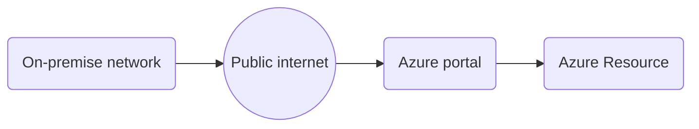

# Requirements
**ExpressRoute Partner** - You first need to subscribe to an Azure ExpressRoute Partner (i.e.
AT&T NetBond, Comcast, Equinix, Etc.) to establish the physical connectivity from your on-premises
Data Centers to the ExpressRoute Partner’s peering location of choice

# Configuration
Typically, ExpressRoute Partner connectivity consists of two physical diversified circuits into and out of
your on-premises Data Center to their backbone. Inside their own infrastructure, they then peer to the Microsoft Global
Footprint of Azure Data Centers in the region where your Azure Tenant will be colocated.

There are two BGP peering types: Private for VNET and Microsoft for PaaS

# Cost
There are two costs associated with ExpressRoute:
1. Those paid to Microsoft - this varies based on port speed required. 1Gbps is usually recommended
1. Those paid to your ISP

# Data Flow
Without ExpressRoute:


With ExpressRoute
```mermaid
graph LR
    A(On-premise network) -- Public internet --> C(Azure Resource (portal))
    A --> B(ExpressRoute) --> D(ISP backbone) --> E(Azure Backbone) --> F(Azure Resource (private, PaaS, SaaS))
```    
