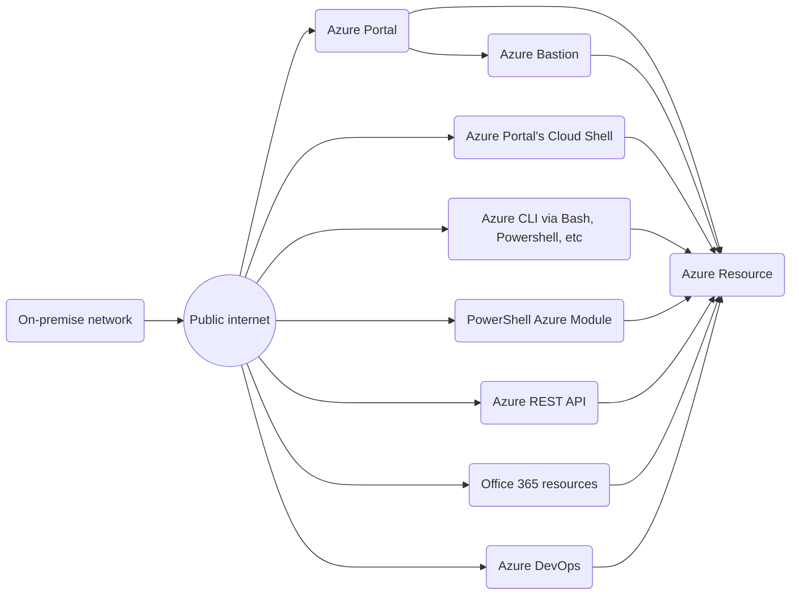
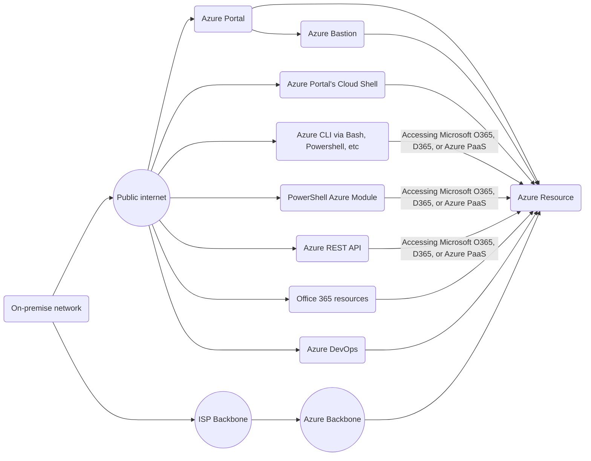

# FAB 
- Private connection between your on-premise data center and Microsoft Azure backbone
- Faster speed
- Least latency
- Better reliability
- More secure (end to end security via both encryption and private link to Azure)
- Can add high availability easily

[FAQ](https://docs.microsoft.com/en-us/azure/expressroute/expressroute-faqs)

# Requirements
**ExpressRoute Partner** - You first need to subscribe to an Azure ExpressRoute Partner (i.e.
AT&T NetBond, Comcast, Equinix, Etc.) to establish the physical connectivity from your on-premises
Data Centers to the ExpressRoute Partner’s peering location of choice

# Configuration
Typically, ExpressRoute Partner connectivity consists of two physical diversified circuits into and out of
your on-premises Data Center to their backbone. Inside their own infrastructure, they then peer to the Microsoft Global
Footprint of Azure Data Centers in the region where your Azure Tenant will be colocated.

There are two BGP peering types [as shown in the documentation](https://docs.microsoft.com/en-us/azure/expressroute/expressroute-circuit-peerings): 
1. **Azure Private Peering** - hooks you up to infrastructure-as-a-service (IaaS) and PaaS services in your vNets
1. **Microsoft Peering** - 
1. **Azure Public is retired** - Connects you to Microsoft's PaaS offerings (Azure SQL Database, Office 365, Dynamics 365, etc)

# Cost
There are two costs associated with ExpressRoute:
1. Those paid to Microsoft - this varies based on port speed required and which flavor you choose, Standard (10 vNets) or Premium (100 vNets)
1. Those paid to your ISP

Speeds as of July 2020: 50 Mbps, 100 Mbps, 200 Mbps, 500 Mbps, 1 Gbps (generally recommended), 2 Gbps, 5 Gbps, 10 Gbps

Each connection comes with two redundant Border Gateway Protocol (BGP) routes in active-active (load-sharing) configuration to Microsoft Enterprise Edge (MSEE) routers. 

# Data Flow
Without ExpressRoute (not including site-to-site VPNs), all traffic crosses public internet - 

With an ExpressRoute "Azure Private Peering", your traffic flow would look like this:

