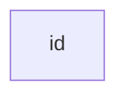
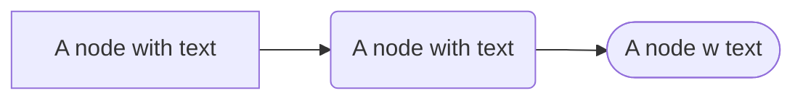
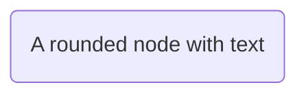
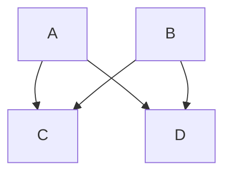
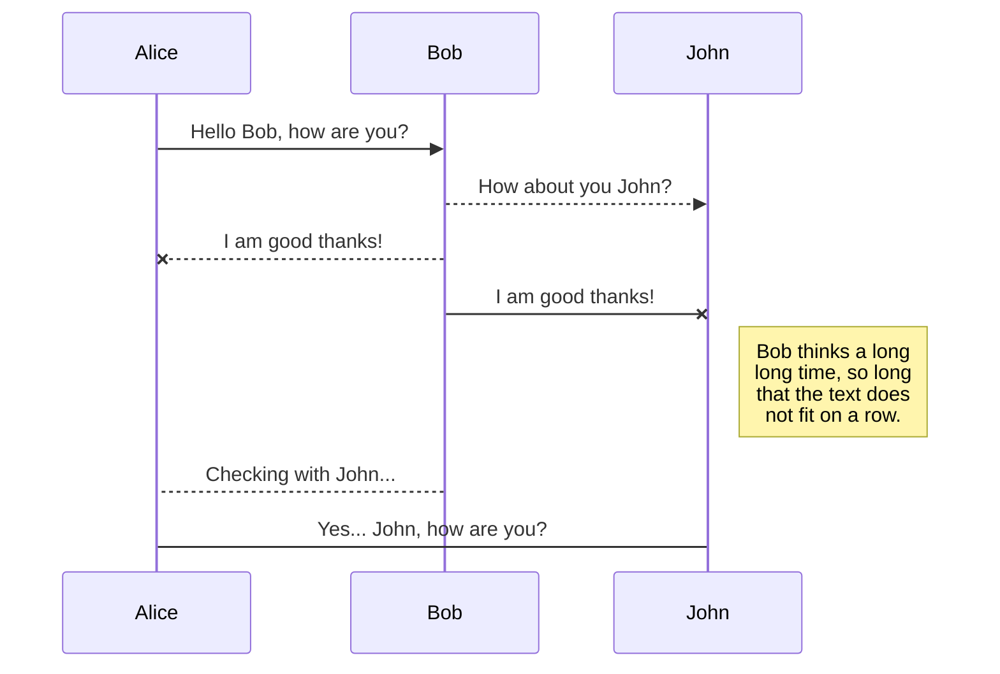
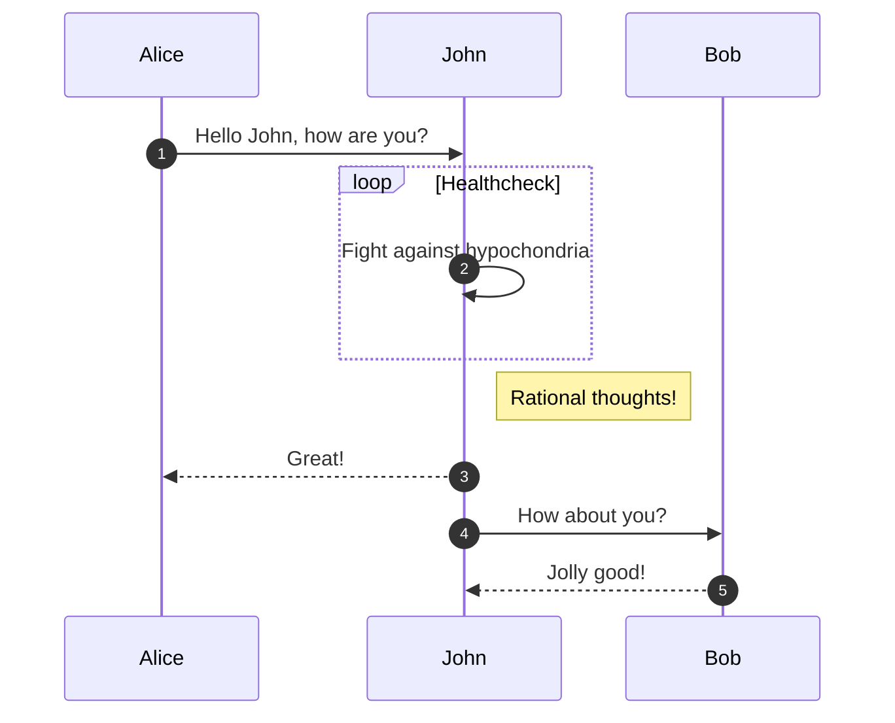
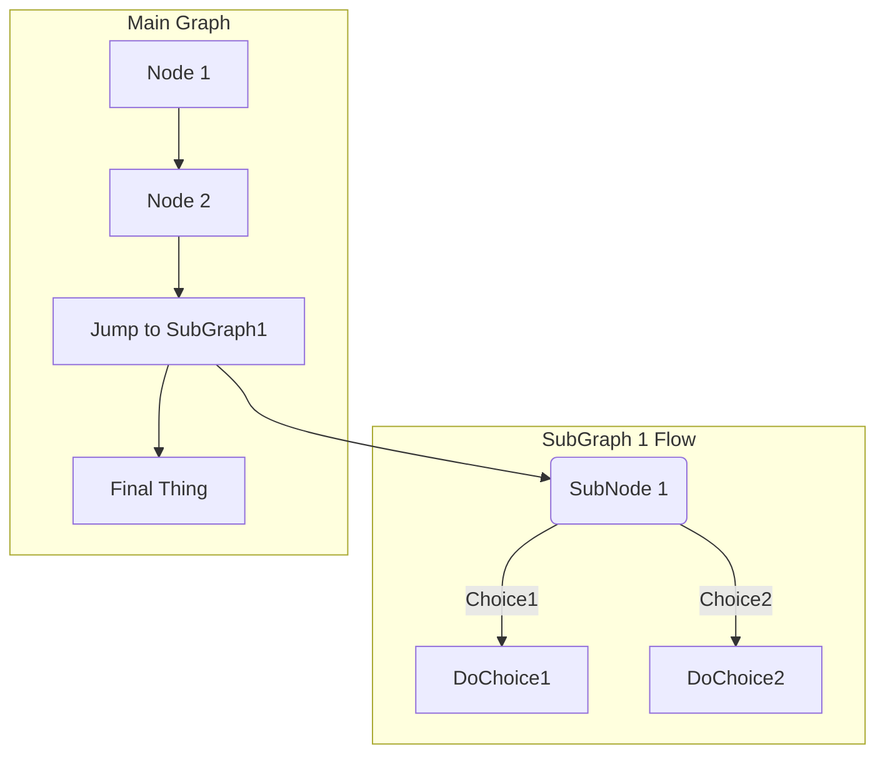

2020-05: Github does not natively support mermaid but you can install the [Chrome extension to add mermaid to github](https://chrome.google.com/webstore/detail/github-%2B-mermaid/goiiopgdnkogdbjmncgedmgpoajilohe/related?hl=en)

https://mermaid-js.github.io/mermaid/#/flowchart?id=graph

https://mermaid-js.github.io/mermaid/#/examples

# Graphs
* TD or TB means top down or top to bottom
* LR means left to right

~~~

~~~

---

~~~

~~~

---

~~~

~~~

---

~~~
```mermaid

```
~~~
```mermaid

```
---

~~~
```mermaid

```
~~~
```mermaid

```
---

~~~

~~~


# Handshake:
```
::: mermaid
sequenceDiagram
    participant Alice
    participant Bob
    Alice ->> Bob: Hello Bob, how are you?
    Bob-->>John: How about you John?
    Bob--x Alice: I am good thanks!
    Bob-x John: I am good thanks!
    Note right of John: Bob thinks a long<br/>long time, so long<br/>that the text does<br/>not fit on a row.

    Bob-->Alice: Checking with John...
    Alice->John: Yes... John, how are you?
:::         
```


# Complex flow
```
sequenceDiagram
    autonumber
    Alice->>John: Hello John, how are you?
    loop Healthcheck
        John->>John: Fight against hypochondria
    end
    Note right of John: Rational thoughts!
    John-->>Alice: Great!
    John->>Bob: How about you?
    Bob-->>John: Jolly good!
```



# Multiple flows
~~~

~~~


